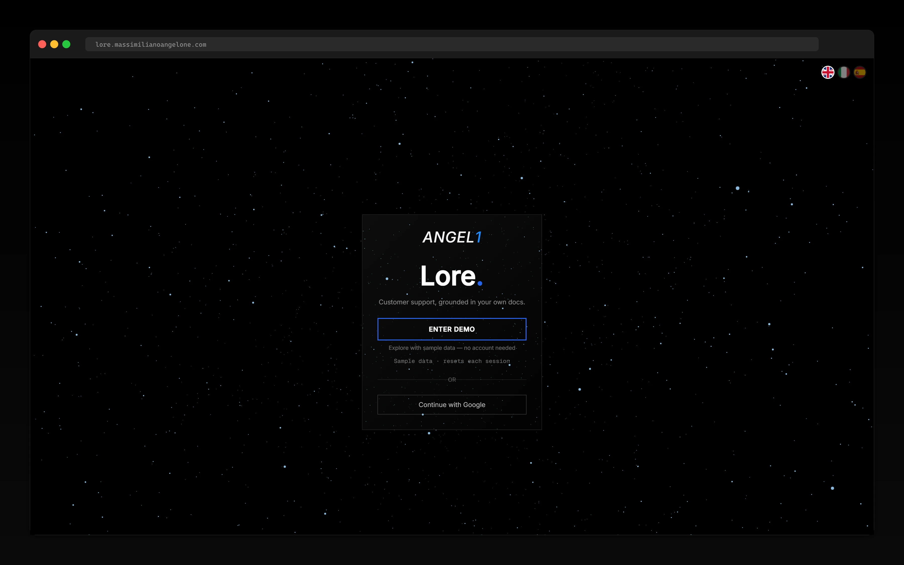
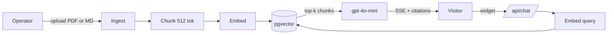

# Lore

Multi-tenant RAG copilot for B2B SaaS support teams. Operators upload docs, customers get instant cited answers via an embeddable chat widget.

**Live demo →** [lore.massimilianoangelone.com](https://lore.massimilianoangelone.com)

One-click *Enter demo* — no signup. Two pre-seeded workspaces (Stratos, Nimbus Labs) reset on each session.



## What it is

A dashboard for support operators with three jobs: ingest a knowledge base (PDF or Markdown), serve cited answers through an embeddable widget, and track usage across tenants. Every query is scoped to an organisation via Supabase Row Level Security — no application-level tenant code touches data access.

## Features

- **Document ingestion** — PDF/Markdown upload → chunk (512 tok) → `text-embedding-3-small` → pgvector
- **Embeddable widget** — `<script>` tag + API key auth, SSE streaming with source citations
- **Multi-tenant by design** — RLS at the database boundary, every query org-scoped
- **API key management** — SHA-256 hashed at rest, plaintext never persisted
- **Onboarding flow** — first-run workspace setup, document upload guide, API key issue
- **Analytics dashboard** — token costs over time (Recharts), top questions, avg response time
- **Mock mode** — three env flags run the app fully offline, no API keys required

## Stack

```
Framework    Next.js 16 (App Router) + React 19 + TypeScript strict
Database     Supabase (Postgres + Auth + RLS) + pgvector
AI           OpenAI gpt-4o-mini + text-embedding-3-small
UI           Tailwind CSS v4 + Base UI + framer-motion + Three.js (login background)
Charts       Recharts
PDF parsing  unpdf
i18n         next-intl (en / it / es)
Tests        Vitest (unit) + Playwright (e2e)
Hosting      Vercel
```

## Architecture



Each operator workspace is an `org` row. RLS policies on `documents`, `chunks`, `conversations`, `messages` enforce `org_id = auth.jwt() ->> 'org_id'`. The widget path bypasses session auth and uses API key authentication with SHA-256-hashed tokens.

## Run locally

```bash
git clone https://github.com/maxange-developer/lore.git
cd lore
pnpm install
cp .env.example .env.local
```

**Zero-config offline mode** — flip these four flags in `.env.local` and skip Supabase + OpenAI setup:

```bash
USE_MOCK_AUTH=true
USE_MOCK_AI=true
USE_MOCK_DATA=true
NEXT_PUBLIC_USE_MOCK=true
```

```bash
pnpm demo:seed   # seeds 2 orgs, 5 docs, 5 conversations, 12 messages, 2 API keys
pnpm dev         # http://localhost:3000 → click "Enter demo"
```

For a real-flavour run with live OpenAI calls, set the four flags to `false` and provide `NEXT_PUBLIC_SUPABASE_URL`, `NEXT_PUBLIC_SUPABASE_ANON_KEY`, `SUPABASE_SERVICE_ROLE_KEY`, `OPENAI_API_KEY`, `NEXT_PUBLIC_APP_URL`. Migrations live under `supabase/migrations/` and run via the Supabase SQL editor.

## Project structure

```
src/
  app/
    (auth)/            Auth route group (login, signup)
    actions/           Server Actions
    api/               Route handlers (chat SSE, ingest, widget)
    app/               Authenticated dashboard
    onboarding/        First-run setup flow
    widget/            Embeddable widget standalone route
  components/
    chat/              Chat UI + streaming primitives
    conversations/     History views
    dashboard/         Analytics, top questions, costs
    documents/         Upload + management
    embed/             Embeddable widget components
    ui/                Base UI primitives
  lib/
    ai/                Retrieve, chat, embeddings (OpenAI + pgvector)
    auth/              Supabase auth helpers
    db/                Server queries
    demo-state/        Per-session demo reset
    mock/              Offline fixtures mirroring the DB
    supabase/          Client + service-role factories
    validations/       Zod schemas
scripts/               seed-mock, translate-i18n
supabase/migrations/   Database schema
tests/                 Vitest + Playwright
```

## Scope

Lore was built over three weeks as a portfolio engagement to demonstrate a multi-tenant RAG architecture end-to-end. The live deploy serves mock data (two seeded orgs, no real customers) and a demo bypass on login. No paying tenants. The performance and cost figures cited in the [case study](https://massimilianoangelone.com/work/lore) are operational targets validated against the seeded dataset, not field metrics.

## License

MIT.

## Author

Built by [Massimiliano Angelone](https://massimilianoangelone.com) — AI-Enhanced MVP Developer, Tenerife.
